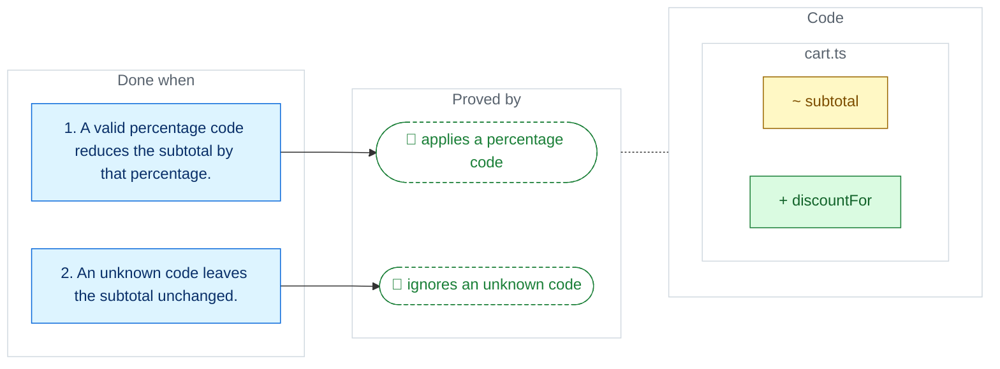

**Shoppers can't apply promotions at checkout.**

`2 files` `+1 new` `~1 changed` `2 tests` ✅ ready



#### What changes <sub>🔒 CI fails the PR if the code doesn't match</sub>
```diff
@@ src/cart.ts @@
  // Applies the discount code, if any, after summing the lines.
- export function subtotal(lines: Line[]): number
+ export function subtotal(lines: Line[], code?: string): number
  // Looks up a code and returns its percentage, or zero when the code is unknown.
+ export function discountFor(code: string): number

@@ test/cart.test.ts @@
+ test 'applies a percentage code'   ✓ #1
+ test 'ignores an unknown code'     ✓ #2
```

<details><summary>Checks, impact and story</summary>

✅ every symbol exists at `790b737` · ✅ every change was read first · ✅ 2/2 criteria have a test · ✅ standards: none apply

Impact: `subtotal` used in ~1 file

> Discount codes at checkout
> 
> As a shopper I want to apply a discount code so the total reflects my promotion.
> 
> Acceptance criteria:
> - A valid percentage code reduces the subtotal by that percentage.
> - An unknown code leaves the subtotal unchanged.

</details>

<details><summary>Plan data (read by CI, don't edit)</summary>

```json storyplan-v1
{
  "id": "STORY-7",
  "title": "Discount codes at checkout",
  "why": "Shoppers can\u0027t apply promotions at checkout.",
  "repo": "/home/runner/work/shop/shop",
  "sha": "790b737479d4491aab077f080ed97940d9e8bd2e",
  "story": "Discount codes at checkout\n\nAs a shopper I want to apply a discount code so the total reflects my promotion.\n\nAcceptance criteria:\n- A valid percentage code reduces the subtotal by that percentage.\n- An unknown code leaves the subtotal unchanged.",
  "criteria": [
    "A valid percentage code reduces the subtotal by that percentage.",
    "An unknown code leaves the subtotal unchanged."
  ],
  "standards": [],
  "changes": [
    {
      "kind": "alter",
      "symbol": "src/cart.ts#subtotal",
      "newSig": "export function subtotal(lines: Line[], code?: string): number",
      "change": "Applies the discount code, if any, after summing the lines."
    },
    {
      "kind": "extend",
      "file": "src/cart.ts",
      "syms": [
        {
          "name": "discountFor",
          "kind": "func",
          "sig": "export function discountFor(code: string): number",
          "does": "Looks up a code and returns its percentage, or zero when the code is unknown.",
          "covers": []
        }
      ]
    },
    {
      "kind": "extend",
      "file": "test/cart.test.ts",
      "syms": [
        {
          "name": "applies_a_percentage_code",
          "kind": "func",
          "sig": "it(\u0027applies a percentage code\u0027, () =\u003E {",
          "does": "Checks a ten percent code takes ten percent off the subtotal.",
          "covers": [
            1
          ]
        },
        {
          "name": "ignores_an_unknown_code",
          "kind": "func",
          "sig": "it(\u0027ignores an unknown code\u0027, () =\u003E {",
          "does": "Checks an unknown code leaves the subtotal as it was.",
          "covers": [
            2
          ]
        }
      ]
    }
  ],
  "loc": 30,
  "allow": [],
  "inspected": [
    "src/cart.ts#subtotal"
  ],
  "status": "published"
}
```

</details>
