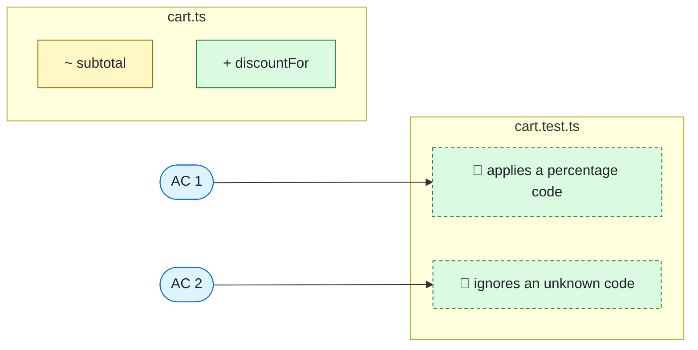

> [!NOTE]
> **Pre-PR for STORY-7**: Shoppers can't apply promotions at checkout.
> Planned against `790b737` · 2 files · ~30 lines · ready for review

<details><summary><b>Original story</b></summary>

> Discount codes at checkout
> 
> As a shopper I want to apply a discount code so the total reflects my promotion.
> 
> Acceptance criteria:
> - A valid percentage code reduces the subtotal by that percentage.
> - An unknown code leaves the subtotal unchanged.

</details>

### Map



### Acceptance criteria

| # | Criterion | Proved by |
|:-:|---|---|
| 1 | A valid percentage code reduces the subtotal by that percentage. | ✅ applies a percentage code |
| 2 | An unknown code leaves the subtotal unchanged. | ✅ ignores an unknown code |

### Changes

🟡 `src/cart.ts`

| | Change | What it does | Covers | Used in |
|:-:|---|---|:-:|:-:|
| ✏️ | `export function subtotal(lines: Line[]): number` | Applies the discount code, if any, after summing the lines. | | ~1 file |
| ➕ | `export function discountFor(code: string): number` | Looks up a code and returns its percentage, or zero when the code is unknown. |  | |

<details><summary>Signature changes</summary>

```diff
@@ subtotal @@
- export function subtotal(lines: Line[]): number
+ export function subtotal(lines: Line[], code?: string): number
```

</details>

🟡 `test/cart.test.ts`

| | Change | What it does | Covers | Used in |
|:-:|---|---|:-:|:-:|
| 🧪 | applies a percentage code | Checks a ten percent code takes ten percent off the subtotal. | AC 1 | |
| 🧪 | ignores an unknown code | Checks an unknown code leaves the subtotal as it was. | AC 2 | |

### Pre-flight checks

- [x] Every symbol exists at `790b737`
- [x] Every changed symbol was read before planning
- [x] Every acceptance criterion has a test (2/2)
- [x] Coding standards cited: none apply

<sub>When the PR opens, CI compares it with this plan and fails on missing or unplanned changes.</sub>

<details><summary>Plan data (read by CI, don't edit)</summary>

```json storyplan-v1
{
  "id": "STORY-7",
  "title": "Discount codes at checkout",
  "why": "Shoppers can\u0027t apply promotions at checkout.",
  "repo": "/home/runner/work/shop/shop",
  "sha": "790b737479d4491aab077f080ed97940d9e8bd2e",
  "story": "Discount codes at checkout\n\nAs a shopper I want to apply a discount code so the total reflects my promotion.\n\nAcceptance criteria:\n- A valid percentage code reduces the subtotal by that percentage.\n- An unknown code leaves the subtotal unchanged.",
  "criteria": [
    "A valid percentage code reduces the subtotal by that percentage.",
    "An unknown code leaves the subtotal unchanged."
  ],
  "standards": [],
  "changes": [
    {
      "kind": "alter",
      "symbol": "src/cart.ts#subtotal",
      "newSig": "export function subtotal(lines: Line[], code?: string): number",
      "change": "Applies the discount code, if any, after summing the lines."
    },
    {
      "kind": "extend",
      "file": "src/cart.ts",
      "syms": [
        {
          "name": "discountFor",
          "kind": "func",
          "sig": "export function discountFor(code: string): number",
          "does": "Looks up a code and returns its percentage, or zero when the code is unknown.",
          "covers": []
        }
      ]
    },
    {
      "kind": "extend",
      "file": "test/cart.test.ts",
      "syms": [
        {
          "name": "applies_a_percentage_code",
          "kind": "func",
          "sig": "it(\u0027applies a percentage code\u0027, () =\u003E {",
          "does": "Checks a ten percent code takes ten percent off the subtotal.",
          "covers": [
            1
          ]
        },
        {
          "name": "ignores_an_unknown_code",
          "kind": "func",
          "sig": "it(\u0027ignores an unknown code\u0027, () =\u003E {",
          "does": "Checks an unknown code leaves the subtotal as it was.",
          "covers": [
            2
          ]
        }
      ]
    }
  ],
  "loc": 30,
  "allow": [],
  "inspected": [
    "src/cart.ts#subtotal"
  ],
  "status": "published"
}
```

</details>
